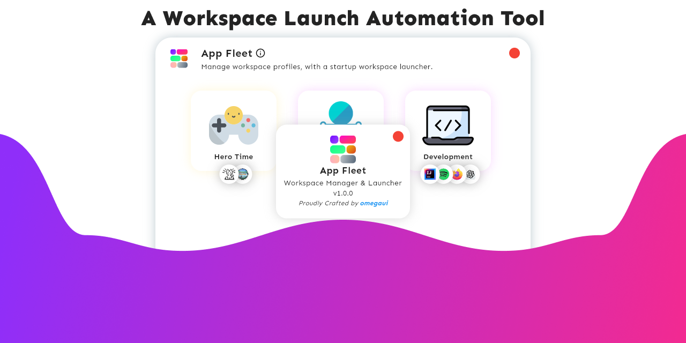
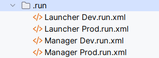
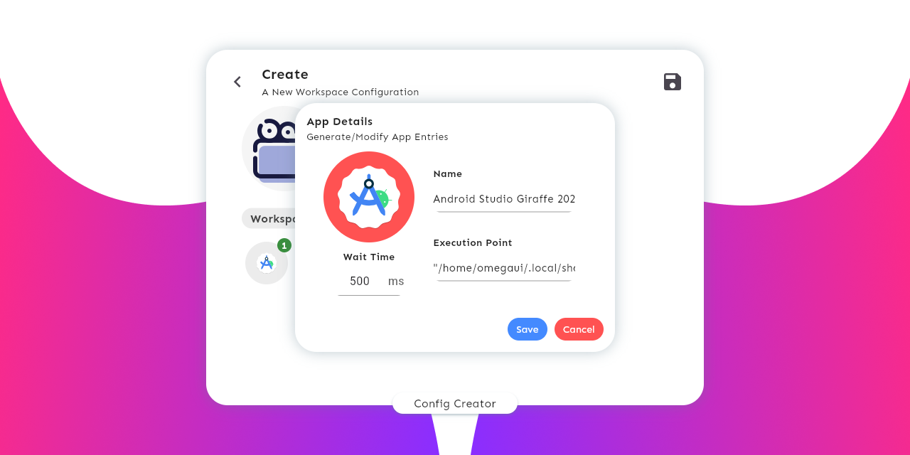
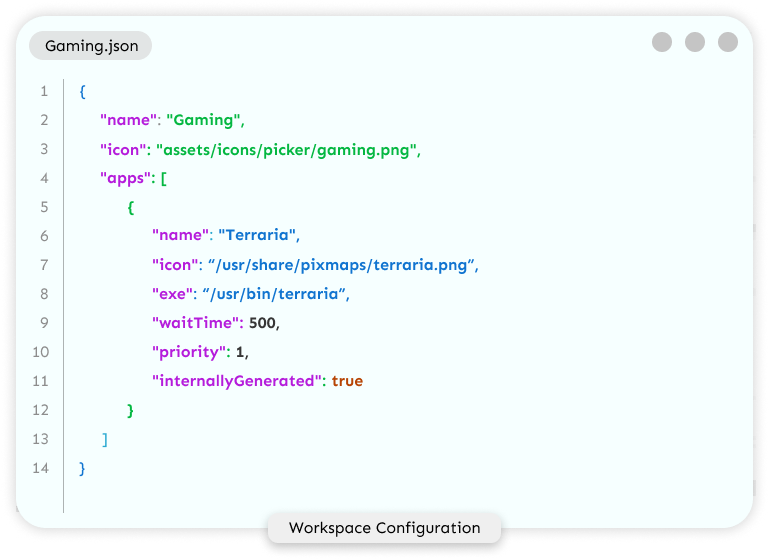
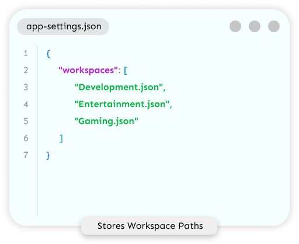

<div align="center">
    
</div>

## Overview

<p style="font-family: Sen">
App Fleet is a workspace management tool <strong>written entirely for the Linux Desktops</strong>,
designed and finely tested on GNOME .
It offers creation of workspace configurations that can later be launched using a startup workspace launcher.
</p>

<p style="font-family: Sen">
Modern Linux Desktop Environments provide their users with the ability to have multiple workspaces on the same desktop;
this is highly beneficial for users
who often switch between the group of apps or group of browser windows with multiple tabs.
<br>
<br>
But launching these many apps manually on startup is a hideous task, sure we can write a script that can do this,
but doing that requires a bit of brainstorm, and also, even on a powerful machine, some apps take some time to
specifically show the first window
(you cannot have another workspace until there is at least one window in all the current workspaces),
and as the requirement increases we have to edit these scripts and maintain them, also,
taking a look at the logs if any error occurs, waiting for the app to actually come up before switching the 
workspace to launch another, ..... phew .. honestly,
this is a lot of work to do just to make a single workspace configuration.
</p>

<p style="font-family: Sen">
But What if there exists a graphical tool to do this?
A Tool that can let you create your workspace configurations,
also, allows you to give your workspaces cool names and icons.
A Tool that can detect installed apps on your system so that you don't have to do a manual entry.
A Tool that can even execute specific browser tabs or shell scripts?
also, what if, it offers a quick workspace launcher once you log in?
</p>

<p style="font-family: Sen">
Here comes App Fleet, 
<strong>A brilliant workspace manager & quick launcher specially designed for GNOME.</strong>
</p>

<p style="font-family: Sen">
<i>You only need wmctrl installed on your distro, also make sure flutter works, then, you can compile App Fleet for your distro.</i>
</p>
<p style="font-family: Sen">
<strong>App Fleet is written using The Flutter Framework.</strong>
</p>

## Features

> **App Fleet comes with a self-update and uninstall feature.**

See [**CHANGELOG**](https://github.com/omegaui/app_fleet/blob/main/CHANGELOG.md) for a full feature list.

## Install (Advanced Installation Options)

### Install using your shell

<p style="font-family: Sen">
Copy and run the following in your terminal:
</p>

```shell
curl https://cdn.jsdelivr.net/gh/omegaui/app-fleet@main/network-install.sh | bash
```

### Install from Precompiled Bundle

```shell
git clone https://github.com/omegaui/app-fleet
cd app-fleet/package
./install.sh
```

### Install from Source

```shell
git clone https://github.com/omegaui/app-fleet
cd app-fleet/package
./install-from-source.sh
```

## Update

<p style="font-family: Sen">
You can seamlessly update app-fleet without touching your workspace configuration.
Once, an update arrives, your installation will notify you about the update.
then, you can simply, update using these three ways:
</p>

### Update directly from the shell

```shell
curl https://cdn.jsdelivr.net/gh/omegaui/app-fleet@main/network-update.sh | bash
```

### Update from Precompiled Bundle

```shell
git clone https://github.com/omegaui/app-fleet
cd app-fleet/package
./update.sh
```

### Update from source

```shell
git clone https://github.com/omegaui/app-fleet
cd app-fleet/package
./update-from-source.sh
```

### Uninstalling

If you have already installed **App Fleet**, and now you want to uninstall,
then, you can do that by running the following (independent of install the method) :

```shell
curl https://cdn.jsdelivr.net/gh/omegaui/app-fleet@main/network-uninstall.sh | bash
```

## Contributing

<p style="font-family: Sen">
Hey, App Fleet is built in the ecosystem of <strong>IntelliJ</strong>.
</p>

<p style="font-family: Sen">
If you want to contribute to App Fleet, make sure you use IntelliJ-Based project configurations and edits.
</p>

<p style="font-family: Sen">
The project is built using <i>clean architecture</i>, and there are four launch configurations. 
</p>

<div align="center">
    
</div>

<p style="font-family: Sen">
The <strong>Prod</strong> configurations are meant for production ready states,
and the <strong>Dev</strong> configurations are meant for debugging purpose.
<br>
You can only see app logs in Dev Mode.
</p>

<p style="font-family: Sen">
App Fleet is designed to automatically generate Bug Reports.
<br>
You can find them at <strong>$HOME/.config/app-fleet/bug-reports`</strong>.
</p>

<p style="font-family: Sen">
<strong>Flutter 3.13.6 or above is Required for compiling the program.</strong>
</p>

## Advanced Configuration Options

### App Entry Customization

<div align="center">
    
</div>

<p style="font-family: Sen">
Some Apps take a specific period of time to load,
<br>
App Fleet offers <strong>wait-time</strong> for that kind of heavy App.
<br>
By Default, each app is given a time period of 500ms to load, which can be customized as per
your needs (usually system performance). 
</p>

### Manual Configuration Editing

<div align="center">
    
</div>

<p style="font-family: Sen">
Configurations are saved in a readable format i.e., json.
<br>
You can directly edit the workspace configs located at $HOME/.config/app-fleet/workspaces
</p>

### Hiding Workspace Configs in Launcher

<div align="center">
    
</div>

<p style="font-family: Sen">
You can even hide some workspaces from coming the launcher mode by removing them from app-settings.json
<br>
this file contains app preferences and is located at $HOME/.config/app-fleet
</p>

### Quick Task Launcher

<p style="font-family: Sen">
There also exists a tiny version of this project, 
its called the <strong><a href="https://github.com/omegaui/floating_action_bar">floating-action-bar</a></strong>,
which can be used to quickly launch anything on any Modern Desktop Environment.
</p>

## What's next?

You can even try the latest beta by selecting the branch with `latest` version number in the branches popup.

<div align="center">
    
</div>

then, you need to [**install from source**](https://github.com/omegaui/app_fleet/tree/main#install-from-source).

#### See what is [**planned**](https://github.com/omegaui/app_fleet/milestone/1) for the next release.

## Support Me

If you have really liked the project and want to support the development of App Fleet.
Then, please consider buying me a coffee.

It helps me to work on the project in my free time.

Scan this [**Qr Code**](github/images/qr-code.png) or <br>

Click the button below to Buy Me a Coffee.

<a href="https://www.buymeacoffee.com/imarham" target="_blank"></a>


<div align="center">
    <h3 style="font-family: Sen">
        App Designed and Crafted by <strong><a href="https://github.com/omegaui">@omegaui</a></strong>
    </h3>
</div>
